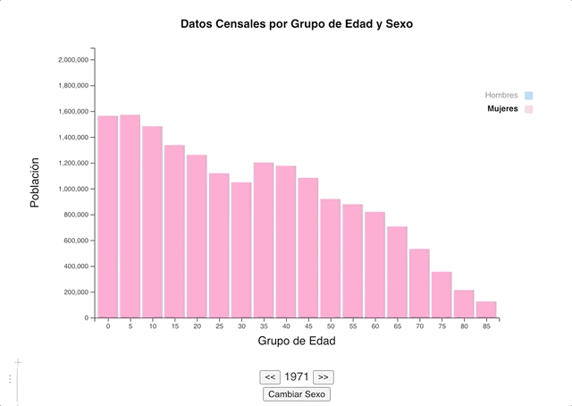
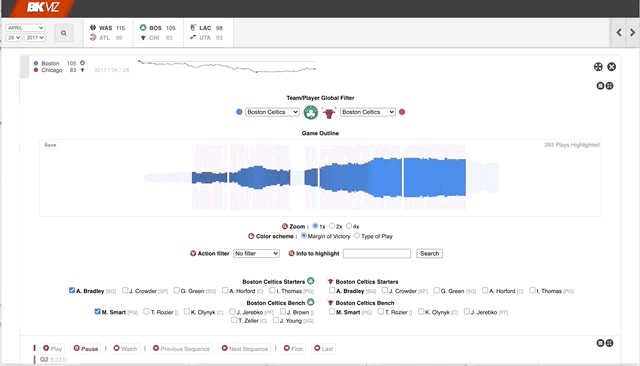
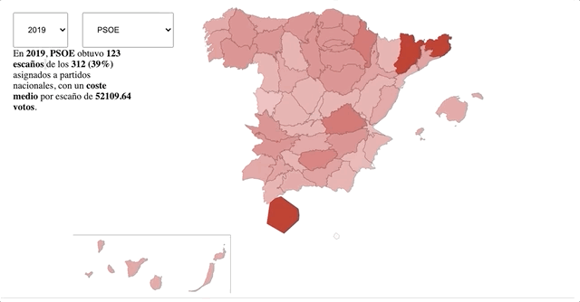
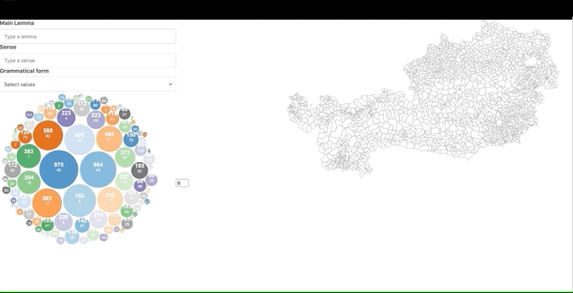
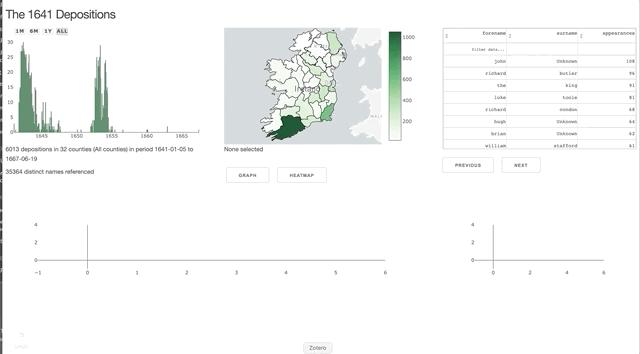
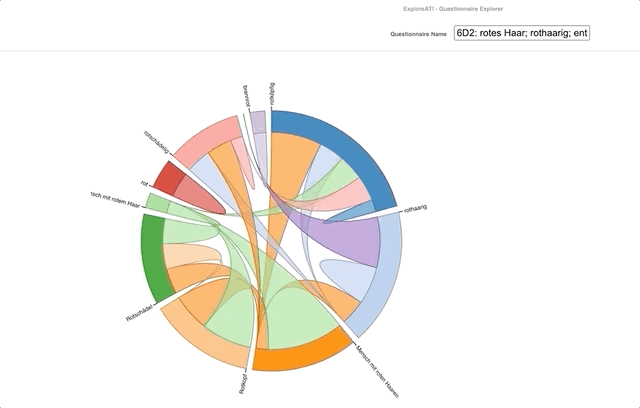

    <h3>GlassViz</h3>
    

        
    

    

        
During my thesis work, I developed <i>GlassViz</i>, a visual text analytics tool for document discovery aimed at interdisciplinary visualization researchers. The work was presented as a short paper at the <a href="http://ieeevis.org/year/2020/">IEEE VIS 2020 conference</a>.

    

    

        <a href="https://arxiv.org/abs/2009.02094" target="_blank"><i class="fas fa-book" aria-hidden="true"></i></a>
        <a href="https://www.youtube.com/watch?v=v7WP4FjpCZ4" target="_blank"><i class="fab fa-youtube" aria-hidden="true"></i></a>
        <a href="../assets/bibtex/glassviz.bib" target="_blank">BibTeX</a>
    

    <h3>Cross-domain Joint Visualization of Documents and Keywords</h3>
    

        
    

    

        
Also during my thesis, I implemented a visualization scheme that set the theoretical foundations of GlassViz.</a>.

    

    

        <a href="https://arxiv.org/abs/2009.02094" target="_blank"><i class="fas fa-book" aria-hidden="true"></i></a>
        <a href="https://www.youtube.com/watch?v=v7WP4FjpCZ4" target="_blank"><i class="fab fa-youtube" aria-hidden="true"></i></a>
    

    

        <a href="https://github.com/ale0xb/keywords-vis/" target="_blank"><i class="fab fa-github" aria-hidden="true"></i></a>
        <a href="https://ieeexplore.ieee.org/document/8766090" target="_blank"><i class="fas fa-book" aria-hidden="true"></i></a>
        <a href="../assets/bibtex/cross_domain.bib" target="_blank">BibTeX</a>
    

    

    <h3>Interactive Dictionary</h3>
    

        
    

    

        
I built this interactive dashboard in <a href="https://d3js.org/">D3.js</a> and <a href="https://elastic.co/">ElasticSearch</a> in a collaboration with the <a href="https://www.oeaw.ac.at/acdh/">Austrian Centre for Digital Humanities</a> in the project <a href="https://www.oeaw.ac.at/acdh/projects/exploreat/">exploreAT!</a>. This was the result of Master's Thesis (in Spanish), for which I obtained the maximum grade (A with Hons.). A summary in English can be found in the chapter of the book "LingVis:Visual Analytics for Linguistics," edited by the <a href="https://www-csli.stanford.edu/">Center for the Study of Language and Information (CSLI)</a> of the University of Stanford.

    

    

        <a href="https://exploreat.acdh-dev.oeaw.ac.at/exploreAT-collectionexplorer" target="_blank"><i class="fas fa-link" aria-hidden="true"></i></a>
        <a href="https://github.com/acdh-oeaw/exploreAT-collectionexplorer" target="_blank"><i class="fab fa-github" aria-hidden="true"></i></a>
        <a href="https://press.uchicago.edu/ucp/books/book/distributed/L/bo28217610.html" target="_blank"><i class="fas fa-book" aria-hidden="true"></i></a>
        <a href="https://zenodo.org/record/2616022#.XJ4Qk-v0nOQ" target="_blank"><i class="fas fa-book" aria-hidden="true"></i></a>
    

    <h3>Visual Analysis of Group Tactic Behavior</h3>
    

        
    

    

        
One of my first projects and visualization papers: a visual analytics prototype built along with sports scientists for analyzing tactic behavior in soccer matches.

    

    

        <a href="https://www.frontiersin.org/articles/10.3389/fpsyg.2018.02416/full" target="_blank"><i class="fas fa-book" aria-hidden="true"></i></a>
        <a href="https://www.youtube.com/watch?v=ilfmYOo4Ouw" target="_blank"><i class="fab fa-youtube" aria-hidden="true"></i></a>
        <a href="../assets/bibtex/soccer-analysis.bib" target="_blank">BibTeX</a>
    

    <h3>Quantile Dotplot</h3>
    

        
    

    

        
 I replicated Matthew Kay's  <a href="https://github.com/mjskay/when-ish-is-my-bus/blob/master/quantile-dotplots.md">R code</a> for generating quantile dotplots in an interactive <a href="https://observablehq.com/">Observable</a> notebook.

    

    

        <a href="https://observablehq.com/@ale0xb/quantile-dotplots" target="_blank"><i class="fas fa-link" aria-hidden="true"></i></a>
        <a href="https://twitter.com/alexbensan/status/1257971895690985472" target="_blank"><i class="fab fa-twitter" aria-hidden="true"></i></a>
    

    <h3>SoccerVis</h3>
    

        
    

    

        
PROgressive VIsual DEcision-Making in Digital Humanities

    

    

        <a href="https://observablehq.com/@ale0xb/quantile-dotplots" target="_blank"><i class="fas fa-link" aria-hidden="true"></i></a>
        <a href="https://twitter.com/alexbensan/status/1257971895690985472" target="_blank"><i class="fab fa-twitter" aria-hidden="true"></i></a>
    

    <h3>D3 tutorial (in Spanish)</h3>
    

        
    

    

        
I created a small intro to D3 in Observable for the course "Visualization & Visual Analytics" of the Master's in Intelligent Systems of the University of Salamanca.

    

    

        <a href="https://observablehq.com/@ale0xb/d3-tutorial" target="_blank"><i class="fas fa-link" aria-hidden="true"></i></a>
        <a href="https://twitter.com/alexbensan/status/1201833512413863936" target="_blank"><i class="fab fa-twitter" aria-hidden="true"></i></a>
    

    <h3>BKViz</h3>
    

        
    

    

        
Exploring Austria's Culture through the Language Glass

    

    <h3>ConceptLights</h3>
    

        
    

    

        
Exploring Austria's Culture through the Language Glass

    

    <h3>Rural Schools in the Castilla y León region</h3>
    
    
        
    

    

        
A Voronoi Map showing influence areas of rural schools in Castilla y León

    

    

        <a href="https://bl.ocks.org/ale0xb/dac7e1086663f23a471864b21fbea5b9" target="_blank"><i class="fas fa-link" aria-hidden="true"></i></a>
    

    <h3>Overrepresentation in the Electoral System in Spain</h3>
    

        
    

    

        
A continous area cartogram showing overrepresentation in the electoral system in Spain

    

    

        <a href="https://bl.ocks.org/ale0xb/2b8eb65eb5e3b6420ca1e67aec93ddef" target="_blank"><i class="fas fa-link" aria-hidden="true"></i></a>
    

    <h3>Topography of Concepts</h3>
    

        
    

    

        
Exploring Austria's Culture through the Language Glass

    

    <h3>Visualization of TCD's 1641 Depositions Dataset</h3>
    

        
    

    

        
Exploring Austria's Culture through the Language Glass

    

    <h3>Concepts in a Chord Diagram</h3>
    

        
    

    

        
Exploring lexicographic questionnaires and concepts in a chord diagram. Built in the context of the <a href="https://www.oeaw.ac.at/acdh/projects/exploreat/">exploreAT!</a> project.

    

    <h3>Food Pyramid Game</h3>
    

        
    

    

        
Not so much about visualization, but this was a participatory design experience of a game with girls from socially-vulnerable backgrounds in the context of the <a href="https://www.oeaw.ac.at/acdh/projects/exploreat/">exploreAT!</a> project.

    

    <h3>Internal Migrations in Spain (2016)</h3>
    

        
    

    

        
A D3 block of a chord diagram showing internal migrations in Spain.

    

    

        <a href="http://bl.ocks.org/ale0xb/ef5837f83edf937ece94a2665d60e5a3" target="_blank"><i class="fas fa-link" aria-hidden="true"></i></a>
    

